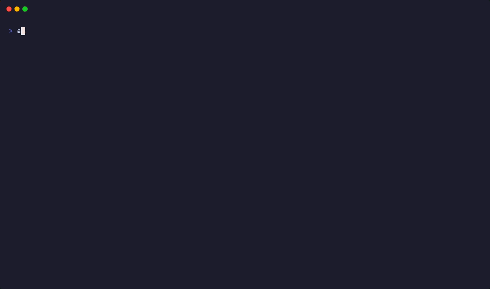
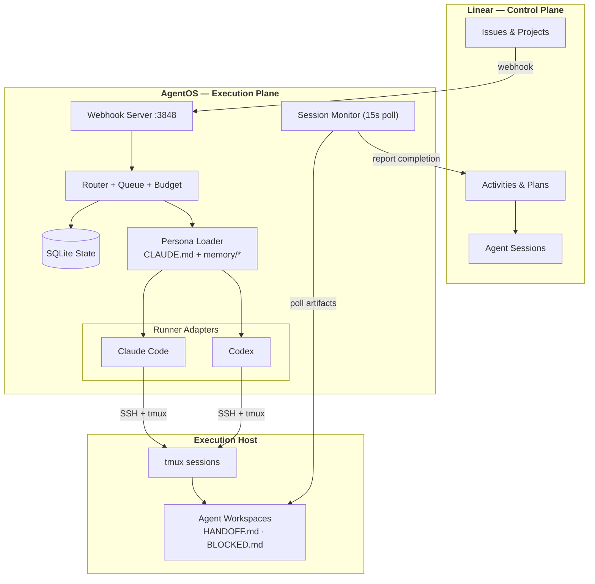

<div align="center">

# AgentOS

**An operating system for AI-native companies.**

Turn [Linear](https://linear.app) into the control plane for a team of AI agents — each with persistent identity, institutional memory, and real decision-making authority.

[](LICENSE)
[](https://www.typescriptlang.org)
[](https://nodejs.org)
[](#testing)

*11,000+ lines of TypeScript · 460+ tests · 5 runtime dependencies*

</div>

---

<p align="center">
  
</p>

## The Problem

AI coding tools give you a single, amnesiac assistant. It forgets everything between sessions. You paste context, re-explain decisions, and micromanage every task. Scale that to a real workload and you're spending more time managing AI than doing high-leverage work.

**AgentOS takes a different approach.** Instead of a tool you prompt, you get a team you manage. Five AI executives — CTO, CPO, COO, Lead Engineer, Research Lead — each with their own identity, memory, and authority. You create a Linear issue, and the right agent picks it up, works autonomously, delegates to others, and reports back. Sessions are ephemeral. Memory is permanent.

> You make the high-leverage calls. Your AI C-suite runs the rest.

## How It Works

```
You (CEO)
 │
 ├── CTO ········ Architecture, code quality, tech decisions
 ├── CPO ········ Product vision, features, user research
 ├── COO ········ Ops, infrastructure, cost management
 ├── Lead Eng ··· Hands-on implementation
 └── Research ··· AI research, experiments, analysis
```

**The workflow:**

1. **Create a Linear issue** — "Refactor the auth module"
2. **AgentOS routes it** — label `agent:cto` → CTO picks it up
3. **Agent works autonomously** — spawns in a tmux session with full persona + memory
4. **Agent delegates** — CTO dispatches Lead Engineer for implementation
5. **Work completes** — agent writes `HANDOFF.md`, Linear updates automatically
6. **Memory persists** — what they learned carries to the next session

Watch any agent work in real-time: `aos jump RYA-42` opens their terminal.

## Architecture

AgentOS uses a **two-plane design** — Linear owns intent and delegation, AgentOS owns execution and runtime. Neither duplicates the other.



### Key Design Decisions

| Decision | Why |
|----------|-----|
| **Linear as control plane** | Don't rebuild project management. Issues are the interface — no new UI to learn. |
| **File-based completion signals** | `HANDOFF.md` on disk is more reliable than parsing agent output. Monitor polls every 15s. |
| **Memory > sessions** | Sessions die. Memory survives. Each spawn is grounded with persona + accumulated knowledge. No context window bloat. |
| **Adapter abstraction** | `RunnerAdapter` interface lets you swap Claude Code ↔ Codex per agent, per task, or on retry. |
| **OAuth per agent** | Each agent has its own Linear OAuth token. When CTO comments, it shows as "CTO" — not you. |
| **Priority queue** | CTO (1) > CPO (2) > COO (3) > Lead (4) > Research (5). Strategic thinking gets resources first. |

## Features

### Death & Resurrection Pattern
The defining architectural pattern. Agent sessions are disposable — kill one, and a new instance spawns with full institutional knowledge compiled from `memory/*` files. No context window limits. No state corruption. The agent "dies and resurrects" as a fresh process grounded with everything it has ever learned.

### Agent-to-Agent Delegation
Agents dispatch work to each other via Linear. CTO can hand off implementation to Lead Engineer. CPO can dispatch Research Lead for analysis. Three delegation modes:

```bash
# Direct dispatch — start another agent on an issue
linear-tool dispatch lead-engineer RYA-42 "Implement the auth refactor per CTO spec"

# Handoff — finish your part, they pick up your workspace
linear-tool handoff cpo RYA-42 "Technical design complete, need product review"

# Ask — async question, they respond when available
linear-tool ask cto RYA-42 "Should we use JWT or session tokens?"
```

### Observable Execution
Every agent runs in a tmux session. `aos jump RYA-42` opens a terminal window directly into the agent's workspace. No black boxes.

```bash
aos status                    # What's running?
aos jump RYA-42               # Attach to agent's terminal
aos agent memory cto          # What does CTO remember?
aos logs RYA-42               # Full event history
```

### Multi-Model Runtime
Unified `RunnerAdapter` interface behind Claude Code and Codex. Each agent has a base model with optional fallback. The abstraction makes model choice transparent to the orchestration layer.

```typescript
interface RunnerAdapter {
  spawn(opts: SpawnOptions): Promise<SpawnResult>;
  isAlive(sessionId: string): boolean;
  kill(sessionId: string): void;
  captureOutput(sessionId: string, lines?: number): string;
}
```

### Budget & Rate Limiting
Per-agent, per-attempt, and daily spending caps. Priority-based queue ensures strategic agents (CTO, CPO) get resources before tactical ones. Automatic cooldown with backoff on rate limits.

### Persistent Identity
Each agent has:
- **Persona** (`CLAUDE.md`) — role definition, authority, communication standards
- **Memory** (`memory/*.md`) — accumulated knowledge across all sessions
- **OAuth token** — posts to Linear as their own identity
- **Config** — model preference, concurrency limits

## How AgentOS Compares

| | AgentOS | CrewAI | AutoGen | LangGraph | OpenAI SDK |
|---|:---:|:---:|:---:|:---:|:---:|
| Persistent identity | **Yes** | No | No | No | No |
| Cross-session memory | **Yes** | Partial | Session | Checkpoint | External |
| PM-native (Linear) | **Yes** | No | No | No | No |
| Agent delegation | **Yes** | Yes | GroupChat | Graph | Handoffs |
| Terminal observability | **Yes** | No | No | No | No |
| Multi-model runtime | **Yes** | Yes | Yes | Yes | Yes |
| Budget controls | **Yes** | No | No | No | No |
| Org hierarchy | **Yes** | Flat | Flat | None | None |

**CrewAI / AutoGen** — Multi-agent frameworks where agents are in-process functions. Great for pipelines, but agents forget everything between runs and have no PM integration.

**LangGraph** — Production-hardened graph orchestration. Excels at workflows within a single application. No concept of agent identity or organizational hierarchy.

**AgentOS** — Agents are organizational members. They have names, roles, memories, and authority. Linear is the interface. You manage a team, not a pipeline.

## Quick Start

### Prerequisites
- Node.js 22+
- macOS (Keychain integration) or Linux
- tmux on the execution host
- A [Linear](https://linear.app) workspace with API key
- [cloudflared](https://developers.cloudflare.com/cloudflare-one/connections/connect-networks/) for webhook tunnel (production)

### Install

```bash
git clone https://github.com/zzhiyuann/agentos.git
cd agentos
cp .env.example .env    # Configure your environment
npm install && npm run build && npm link
```

### Docker (alternative)

```bash
git clone https://github.com/zzhiyuann/agentos.git
cd agentos
cp .env.example .env    # Configure your environment (see below)
docker compose up -d    # Starts webhook server + tunnel
```

The Docker setup includes the webhook server, cloudflared tunnel, and persistent state. See [Docker setup details](docs/GETTING-STARTED.md#docker-setup) for full configuration.

### Configure

Edit `.env` with your Linear team details (see `.env.example`), then:

```bash
# Validate config and initialize database
aos setup --api-key <YOUR_LINEAR_API_KEY>

# Set up OAuth for agent identities
aos auth --client-id <OAUTH_CLIENT_ID> --client-secret <OAUTH_SECRET>
```

### Run

```bash
# Start the webhook server for automatic routing
aos serve

# Or start an agent manually
aos agent start cto RYA-42

# Watch what's happening
aos status
aos jump RYA-42
aos agent memory cto
```

## CLI Reference

```bash
# Agent management
aos agent list                     # Roster + status + memory
aos agent start <role> [issue]     # Start with full persona
aos agent stop <role>              # Graceful stop
aos agent talk <role> "msg"        # Message running agent
aos agent memory <role>            # View knowledge

# Task operations
aos spawn <issue>                  # Ephemeral agent on issue
aos batch RYA-1 RYA-2 RYA-3       # Batch spawn
aos status [--all]                 # Active sessions
aos jump <issue>                   # Attach to terminal
aos kill <issue> [--done]          # Terminate session
aos resume <issue>                 # Retry failed attempt
aos queue                          # View priority queue

# Infrastructure
aos setup                          # Initialize system
aos serve [--port 3848]            # Webhook server
aos watch                          # Polling mode (no webhook)

# Company operations
aos company start                  # Enable full company
aos company stop                   # Disable + stop agents
aos company status                 # Health check
```

## Project Structure

```
src/
├── cli.ts                 # CLI entry point (Commander)
├── core/
│   ├── linear.ts          # Linear API — dual client (personal + OAuth)
│   ├── db.ts              # SQLite state management
│   ├── tmux.ts            # Remote SSH + tmux session control
│   ├── persona.ts         # Agent identity & memory loader
│   ├── router.ts          # Issue → agent routing
│   ├── queue.ts           # Priority-based job queue
│   ├── budget.ts          # Spending limits enforcement
│   └── oauth.ts           # Token management (Keychain + file)
├── commands/
│   ├── serve.ts           # Webhook server + session monitor (2,300 LOC)
│   ├── agent.ts           # agent list/start/stop/talk/memory
│   ├── spawn.ts           # Ephemeral agent spawning
│   └── ...                # status, jump, kill, watch, queue
└── adapters/
    ├── types.ts           # RunnerAdapter interface
    ├── claude-code.ts     # Claude Code adapter
    └── codex.ts           # Codex adapter

docs/
├── architecture.md        # System design & data flow
├── competitive-analysis.md # 9+ framework comparison
├── agent-guide.md         # How to work as an agent
├── quickstart.md          # Setup guide
└── ...
```

## Testing

```bash
npm test                   # 460+ passing tests
npm run test:watch         # Watch mode
npm run test:coverage      # Coverage report
```

Test coverage spans webhook event classification, routing logic, priority queue, database operations, and adapter behavior.

## Development

```bash
# Run without building
npx tsx src/cli.ts

# Build
npm run build

# Dev workflow
npx tsx src/cli.ts agent list
npx tsx src/cli.ts status --all
```

## Technical Details

- **Runtime:** Node.js 22+ with ES2022 modules
- **Language:** TypeScript 5.9 (strict mode)
- **State:** SQLite via better-sqlite3
- **API:** Linear GraphQL (Agent Platform APIs: AgentSession, AgentActivity)
- **Execution:** SSH + tmux on remote host, Cloudflare tunnel for webhooks
- **Auth:** macOS Keychain with file fallback, OAuth2 client_credentials per agent
- **Dependencies:** 5 runtime (`@linear/sdk`, `better-sqlite3`, `chalk`, `commander`, `discord.js`)

## Contributing

See [CONTRIBUTING.md](CONTRIBUTING.md) for setup, coding standards, and PR process. For a thorough first-run walkthrough, see [docs/GETTING-STARTED.md](docs/GETTING-STARTED.md).

Areas where help is especially valuable:
- **New adapters** — Gemini, local models, etc.
- **MCP integration** — tool interoperability
- **Memory strategies** — smarter pruning, summarization, retrieval
- **Cross-platform** — Linux/Windows secret storage

## License

MIT
