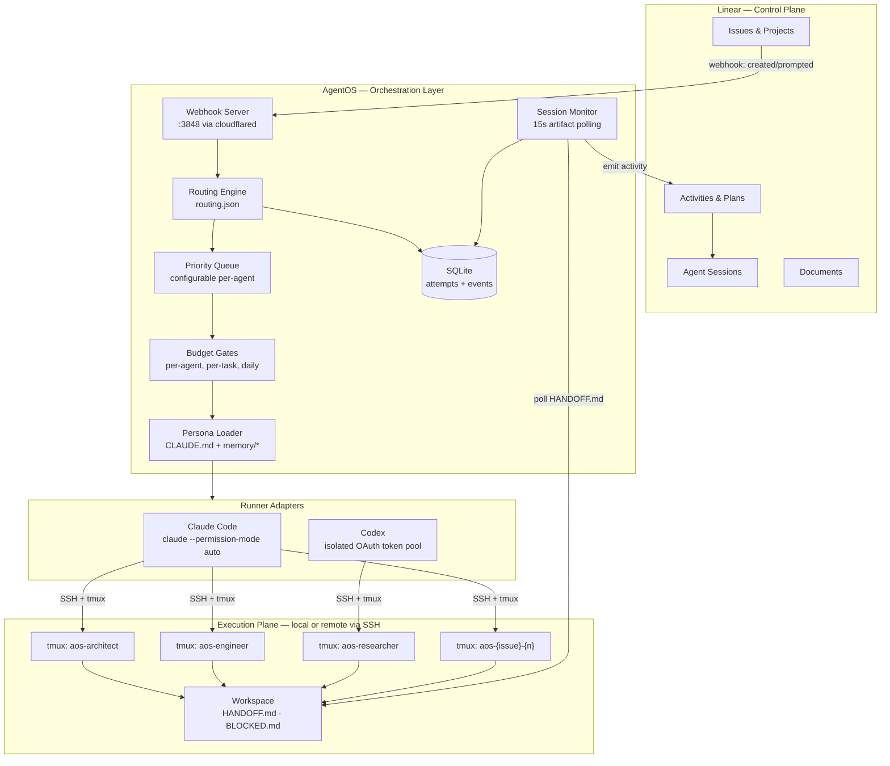
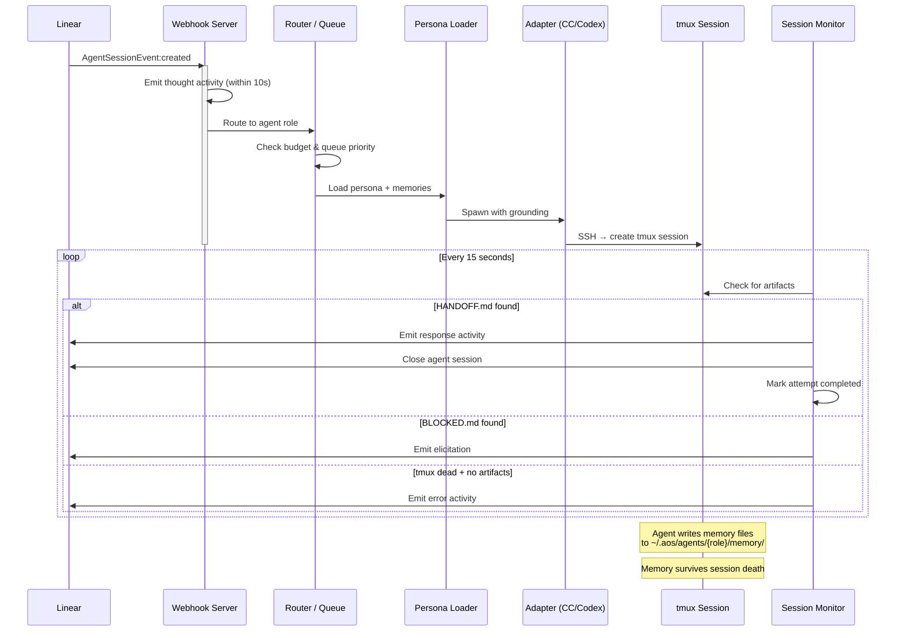
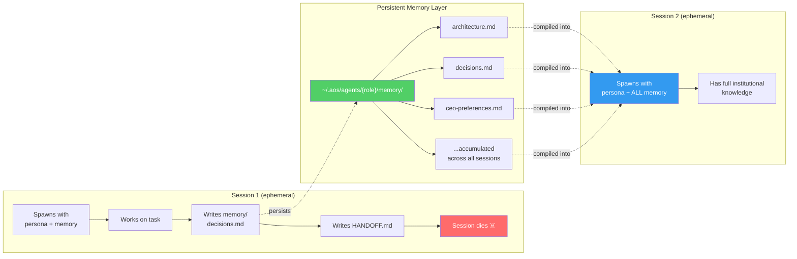
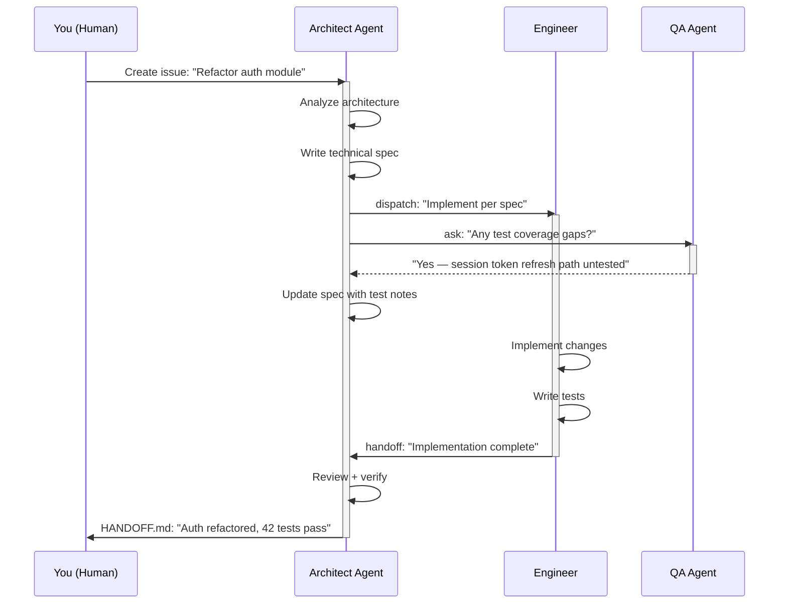
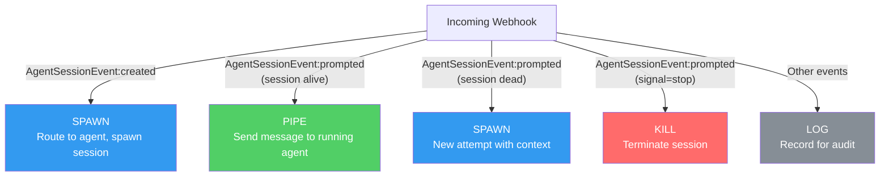

# AgentOS Architecture

> A deep dive into how AgentOS turns Linear into a control plane for AI agents.

## Design Principles

1. **Linear is the control plane** — intent, ownership, review. Don't rebuild project management.
2. **AgentOS is the execution plane** — who runs, where, how to stop/resume/handoff.
3. **Memory > sessions** — sessions are ephemeral, grounded with persona + memories each time.
4. **Agents are team members, not tools** — each has identity, authority, and accumulated knowledge.
5. **Model-flexible** — each agent can run on Claude Code or Codex, swappable at any time.

---

## System Overview



---

## Session Lifecycle

The core loop of AgentOS: from Linear issue to completed work with persistent memory.



---

## Death & Resurrection Pattern

The defining architectural pattern of AgentOS. Sessions are disposable; memory is permanent.



**Why this matters:**
- No context window limits — memory is compiled fresh, not accumulated in a growing conversation
- No state corruption — each session starts clean
- Graceful failure — if a session crashes, institutional knowledge is intact
- Scalable knowledge — agents get smarter over time without getting slower

---

## Agent Delegation Flow

Agents collaborate through Linear, not direct process communication.



**Three delegation modes:**

| Mode | When to use | What happens |
|------|------------|--------------|
| **dispatch** | Start another agent on work | Target agent spawns on the issue immediately |
| **handoff** | You're done, they continue | Target picks up your workspace + HANDOFF.md |
| **ask** | Need input, don't block | Async question — they respond when available |

---

## Data Model

### SQLite Schema

```sql
-- Core state tracking
CREATE TABLE attempts (
    id TEXT PRIMARY KEY,
    issue_id TEXT NOT NULL,           -- Linear issue UUID
    issue_key TEXT NOT NULL,          -- e.g., "ENG-42"
    agent_session_id TEXT,            -- Linear AgentSession UUID
    agent_type TEXT NOT NULL,         -- cto, cpo, lead-engineer, etc.
    runner_session_id TEXT,           -- CC session / Codex thread ID
    tmux_session TEXT,                -- tmux handle for jump/kill
    attempt_number INTEGER,
    status TEXT DEFAULT 'pending',    -- pending → running → completed/failed/blocked
    host TEXT NOT NULL,
    workspace_path TEXT,
    budget_usd REAL,
    cost_usd REAL DEFAULT 0,
    created_at TEXT,
    updated_at TEXT,
    completed_at TEXT,
    error_log TEXT
);

-- Event audit trail
CREATE TABLE events (
    id INTEGER PRIMARY KEY AUTOINCREMENT,
    attempt_id TEXT REFERENCES attempts(id),
    event_type TEXT NOT NULL,
    payload TEXT,                     -- JSON
    created_at TEXT DEFAULT (datetime('now'))
);
```

### Agent Identity Model

```
~/.aos/agents/{role}/
├── CLAUDE.md              # Persona: role, authority, communication standards
├── MEMORY.md              # Index of all memory files
├── config.json            # { baseModel: "cc", linearClientId: "..." }
├── .oauth-token           # Linear OAuth bearer token
└── memory/
    ├── architecture.md    # Technical decisions + rationale
    ├── preferences.md    # How the team likes to work
    ├── tech-debt.md       # Known issues, priorities
    └── ...                # Grows across sessions
```

---

## Linear Integration

### Webhook Events



### Agent Platform APIs Used

| API | Purpose |
|-----|---------|
| `agentSessionCreateOnIssue` | Create session for proactive work |
| `agentActivityCreate (thought)` | Status updates, reasoning |
| `agentActivityCreate (response)` | Completion with results |
| `agentActivityCreate (error)` | Failure reporting |
| `agentActivityCreate (elicitation)` | Ask human for input |
| `agentSessionUpdate (plan)` | Step-by-step progress tracking |
| `documentCreate` | Attach handoff documents to issues |

---

## Adapter System

Both Claude Code and Codex implement a unified interface:

```typescript
interface RunnerAdapter {
  spawn(opts: SpawnOptions): Promise<SpawnResult>;
  resume?(sessionId: string): Promise<void>;
  fork?(sessionId: string): Promise<SpawnResult>;
  isAlive(sessionId: string): boolean;
  kill(sessionId: string): void;
  captureOutput(sessionId: string, lines?: number): string;
}
```

**Claude Code Adapter:**
- Spawns tmux sessions named `aos-{role}` or `aos-{issueKey}-{n}`
- Writes persona to workspace `.claude/CLAUDE.md`
- Pre-trusts workspace via `settings.local.json`
- Runs `claude --permission-mode auto` in tmux

**Codex Adapter:**
- Isolated HOME directories per role (`~/.codex-agents/{role}/`)
- Prevents concurrent OAuth token refresh race conditions
- Falls back through role-specific home → worker pool

---

## Routing Engine

Issues flow through a configurable rule set:

```json
{
  "rules": [
    { "label": "agent:architect",  "agent": "architect" },
    { "label": "agent:engineer",  "agent": "engineer" },
    { "project": "Feature Roadmap", "agent": "engineer" },
    { "default": true, "agent": "engineer" }
  ]
}
```

Rules are evaluated top-to-bottom. First match wins. Labels take priority over project rules. Default catches unmatched issues.

---

## Infrastructure

AgentOS supports both single-machine and split-machine deployments.

### Single Machine (simplest)

```
┌────────────────────────────────┐
│   Your Machine                  │
│                                 │
│  AgentOS server (:3848)         │
│  SQLite state (~/.aos/state.db) │
│  cloudflared tunnel             │
│  tmux sessions (local)          │
│  Agent workspaces               │
│  Claude Code / Codex            │
└────────────────────────────────┘
         ▲
         │ webhook
┌────────┴──────────┐
│  Linear Cloud      │
│  (control plane)   │
└───────────────────┘
```

### Split Machine (remote execution)

```
┌─────────────────────┐        ┌──────────────────────┐
│  Control Machine     │        │  Execution Host       │
│                      │  SSH   │                       │
│  AgentOS server      │───────▶│  tmux sessions        │
│  SQLite state        │        │  Agent workspaces     │
│  cloudflared tunnel  │        │  Claude Code / Codex  │
│  Agent personas      │        │                       │
└─────────────────────┘        └──────────────────────┘
         ▲                              │
         │ webhook                      │ (artifacts)
         │                              │
┌────────┴──────────┐                   │
│  Linear Cloud      │◀────────────────┘
│  (control plane)   │   API (activities, sessions)
└───────────────────┘
```

**Network:** Any SSH-accessible network between control and execution hosts. Cloudflare tunnel exposes webhook server to Linear.

---

## Future Roadmap

- **MCP integration** — tool interoperability across agents
- **Additional adapters** — Gemini, local models
- **Smarter memory** — pruning, summarization, semantic retrieval
- **Multi-tenant** — support for teams beyond solo founder
- **A2A protocol** — agent-to-agent interop with external systems
